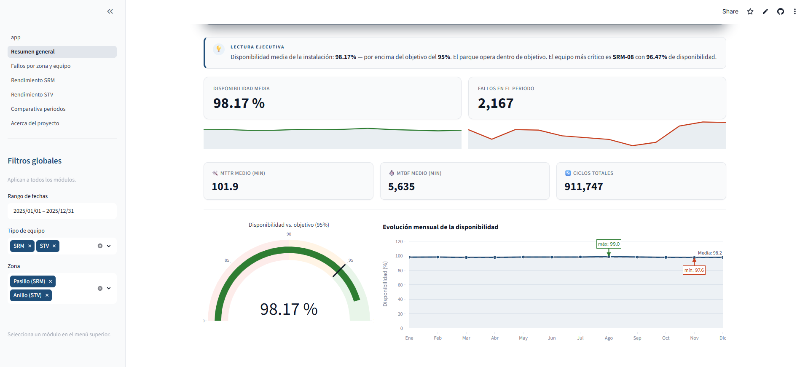
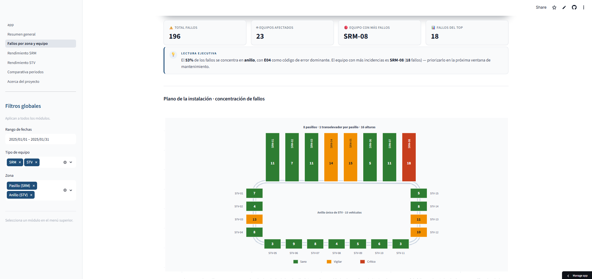
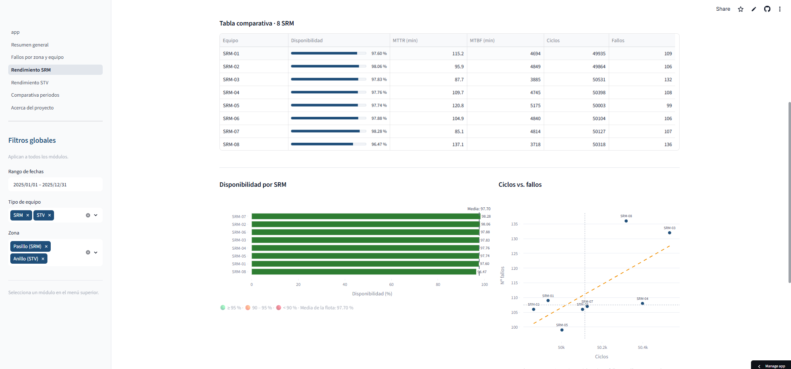
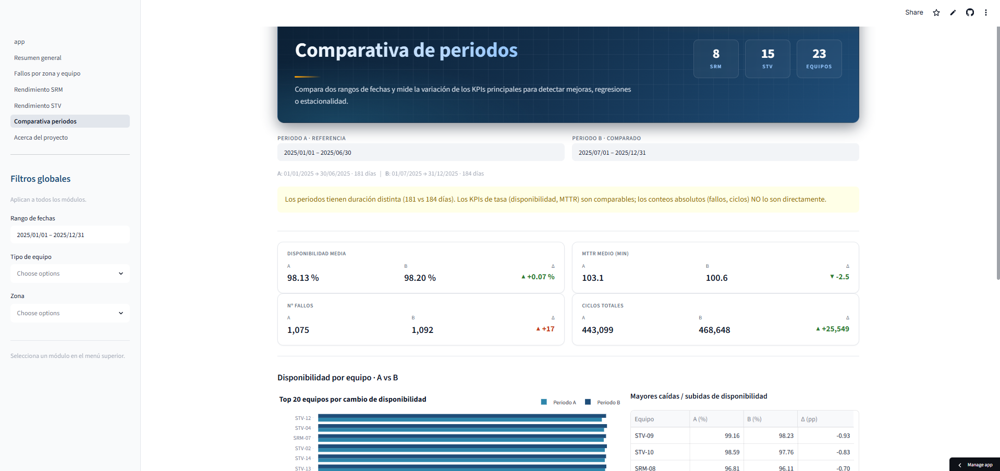

# Análisis de datos operacionales AS/RS

> Del log del WMS a la decisión de mantenimiento.

Dashboard de mantenimiento para un almacén automatizado de 8 pasillos (un transelevador SRM por pasillo) servidos por un anillo único de 15 vehículos de transferencia (STV). Convierte los registros crudos del WMS/WCS en MTTR, MTBF, disponibilidad y patrones de fallo, accionables a nivel de equipo, zona y celda. Opera sobre datos simulados que replican el esquema de un WMS/WCS.


---

## Capturas

> Para generar las capturas: arranca la app (`streamlit run app.py`) y guarda los PNG en `assets/screenshots/` con los nombres indicados.

| | |
|---|---|
|  |  |
| **Módulo 0** · Resumen general | **Módulo 1** · Fallos por zona |
|  |  |
| **Módulo 2** · Rendimiento SRM | **Módulo 4** · Comparativa de periodos |

---

## Módulos

| # | Módulo | Qué hace |
|---|---|---|
| 0 | Resumen general | KPIs globales, evolución mensual, top 5 peor disponibilidad |
| 1 | Fallos por pasillo | Plano de la instalación (pasillos + anillo STV), rankings, heatmap del alzado |
| 2 | Rendimiento SRM | 8 transelevadores · MTTR/MTBF/disponibilidad/ciclos por equipo |
| 3 | Rendimiento STV | 15 vehículos del anillo único · MTTR/MTBF/disponibilidad/ciclos por equipo |
| 4 | Comparativa de periodos | A vs B, variación de KPIs, equipos con mayor regresión |
| 5 | Acerca del proyecto | Contexto, autoría, roadmap |

Cada módulo expone los datasets que calcula como descarga CSV (formato Excel ES).

---

## Requisitos

- Python 3.11+
- Las dependencias están en `requirements.txt`

```
pip install -r requirements.txt
```

## Generar los datos simulados

```
python scripts/generar_datos.py --semilla 42 --salida data/
```

Esto crea cuatro ficheros CSV en `data/`:

- `equipos.csv` — inventario de los 23 equipos (8 SRM + 15 STV del anillo)
- `tipos_error.csv` — catálogo de códigos de error
- `misiones.csv` — ~1 año de misiones (2025-01-01 a 2025-12-31, ~0,94 M filas)
- `eventos_incidencia.csv` — fallos correlacionados con la carga de misiones

## Ejecutar la aplicación

```
streamlit run app.py
```

## Ejecutar los tests

```
pytest tests/ -v
```

## Ejecutar con Docker

La imagen genera el dataset durante el build, así que no necesitas instalar Python ni dependencias localmente:

```
docker build -t analisis-asrs .
docker run -p 8501:8501 analisis-asrs
```

Luego abre [http://localhost:8501](http://localhost:8501).

## Estructura del proyecto

```
scripts/generar_datos.py   Generador de datos simulados (independiente de la app)
src/config.py              Constantes globales
src/data_loader.py         Carga y filtrado de datos (I/O puro)
src/kpis.py                Cálculo de KPIs: MTTR, MTBF, disponibilidad, ciclos
src/charts.py              Helpers de plotly (devuelven figuras, no pintan)
src/export.py              Botones de descarga CSV reutilizables
src/insights.py            Lecturas ejecutivas por módulo
src/sidebar.py             Filtros globales compartidos
src/theme.py · styles.py   Tema corporativo y CSS inyectado
app.py                     Entry point de Streamlit con filtros globales
pages/                     Un archivo por módulo analítico
tests/                     Tests unitarios de kpis.py y coherencia del dataset
```

## Roadmap

- Migración a datos reales del WMS/WCS manteniendo el mismo esquema y la misma capa de cálculo.
- Despliegue como webapp persistente conectada a base de datos (Next.js + base de datos gestionada).
- Integración con la herramienta Grafana de monitorización en tiempo real ya en marcha en la instalación.
